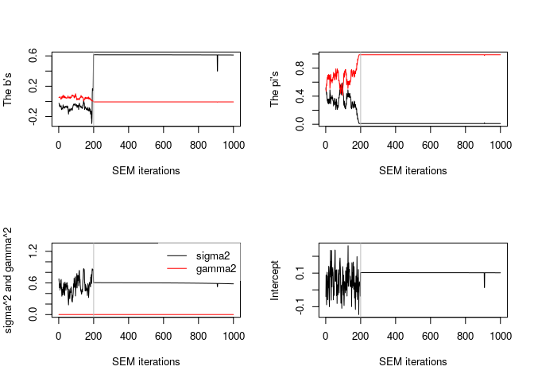

<!-- README.md is generated from README.Rmd. Please edit that file -->

# clere: Simultaneous Variables Clustering and Regression

<!-- badges: start -->

[](https://github.com/mcanouil/clere)
[](https://github.com/mcanouil/clere)
[](https://cran.r-project.org/package=clere)
[](https://cran.r-project.org/web/checks/check_results_clere.html)
[](https://cran.r-project.org/package=clere)
<!-- badges: end -->

Implements an empirical Bayes approach for simultaneous variable
clustering and regression. This version also (re)implements in C++ an R
script proposed by Howard Bondell that fits the Pairwise Absolute
Clustering and Sparsity (PACS) methodology (see Sharma et al (2013)
<DOI:10.1080/15533174.2012.707849>).

## Installation

You can install the released version of clere from
[CRAN](https://CRAN.R-project.org) with:

``` r
install.packages("clere")
```

And the development version from [GitHub](https://github.com/) with:

``` r
# install.packages("remotes")
remotes::install_github("mcanouil/clere")
```

## Example

``` r
library(clere)

x <- matrix(rnorm(50 * 100), nrow = 50, ncol = 100)
y <- rnorm(50)

model <- fitClere(y = y, x = x, g = 2, plotit = FALSE)

plot(model)
```



``` r

clus <- clusters(model, threshold = NULL)

predict(model, newx = x + 1)
#>  [1] 1.925147 1.640999 1.679994 1.625468 1.758027 1.850437 2.035931 1.490719
#>  [9] 2.023115 1.838891 1.911834 1.780355 1.609614 1.647767 1.922336 1.931111
#> [17] 1.615539 1.634079 1.827008 1.715950 1.565292 1.506728 1.976944 1.926210
#> [25] 1.996468 1.786399 1.430099 1.625339 2.125354 1.646800 1.743897 1.613056
#> [33] 1.919351 1.902138 2.087648 1.254038 2.153739 1.726456 1.756179 1.765007
#> [41] 1.812709 1.781935 1.761190 1.939952 1.671561 1.677493 1.749281 1.917779
#> [49] 1.831188 1.472350

summary(model)
#>  -------------------------------
#>  | CLERE | Yengo et al. (2016) |
#>  -------------------------------
#> 
#>  Model object for  2 groups of variables ( user-specified )
#> 
#>  ---
#>  Estimated parameters using SEM algorithm are
#>  intercept = -0.04571
#>  b         = 0.01649 0.07329
#>  pi        = 0.96815 0.03185
#>  sigma2    = 1.131
#>  gamma2    = 7.66e-05
#> 
#>  ---
#>  Log-likelihood =  -83.89 
#>  Entropy        =  13.743 
#>  AIC            =  179.79 
#>  BIC            =  191.26 
#>  ICL            =  205
```

## Citing clere

<p>

Yengo L, Jacques J, Biernacki C, Canouil M (2016). “Variable Clustering
in High-Dimensional Linear Regression: The R Package clere.” <em>The R
Journal</em>, <b>8</b>(1), 92–106. doi:
<a href="https://doi.org/10.32614/RJ-2016-006">10.32614/RJ-2016-006</a>.

</p>

    @Article{,
      title = {{Variable Clustering in High-Dimensional Linear Regression: The R Package clere}},
      author = {Loïc Yengo and Julien Jacques and Christophe Biernacki and Mickael Canouil},
      journal = {The R Journal},
      address = {Oxford, England},
      year = {2016},
      month = {apr},
      doi = {10.32614/RJ-2016-006},
      pages = {92--106},
      volume = {8},
      number = {1},
    }

## Getting help

If you encounter a clear bug, please file a minimal reproducible example
on [github](https://github.com/mcanouil/NACHO/issues).  
For questions and other discussion, please contact the package
maintainer.

-----

Please note that this project is released with a [Contributor Code of
Conduct](https://github.com/mcanouil/NACHO/blob/master/.github/CODE_OF_CONDUCT.md).  
By participating in this project you agree to abide by its terms.
